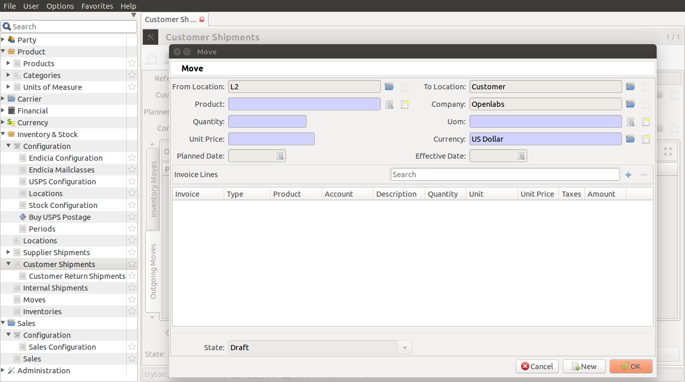

New Shipment and Shipping Label
================================

* `Creating a new shipment`_
* `Generate shipping label`_

.. _Creating a new shipment:

Creating A new Shipment
------------------------

1. Go to ``Inventory & Stock`` and select ``Customer Shipments``. Click on
   ``Create a new record``.

.. figure:: images/15.png

2. Under Customer Shipments, fill in all the fields. 

These are:

* **Reference**: A reference number.
* **Code**: Unique code given to identify the shipment.
* **Customer**: Customer for whom the shipment is created.
* **Delivery Address**: Address to where the the shipment will be delivered.
* **Planned Date**: Date when Shipment will be assigned.
* **Effective Date**: Date when shipment will be dispatched.
* **Company**: Seller of the product.
* **Warehouse**: Storage location from where the outgoing moves will occur.
* **Carrier**: The shipment carriers available, it this case it would be USPS.
* **Tracking Number**: Unique tracking number of the shipment. This can be 
  generated when shipment is packed and ready for dispatch.
* **Override Weight**: Weight which will be overrided.

After filling these details, under the Outgoing Moves Tab, click on 
``Create a new record``. Alternatively, press <F3> to create a new record.

The following fields are present in the Outgoing Moves Tab:

* **From Location**: Location of the storage warehouse.
* **To Location**: Location of the delivery address. 
* **Product**: Name of Product
* **Company**: Name of Seller
* **Quantity**: Quantity of the single product.
* **UOM**: Unit of Measurement. The magnitude of physical quantity of prodcuct
  purchased.
* **Unit Price**: Price of a single unit.
* **Currency**: Currency to be used in billing. This can be different, based on
  currency systems of different countries.
* **Planned Date**: Date when shipment will be assigned.
* **Effective Date**: Date of dispatch of shipment.
* **Invoice Lines**: Invoice Details of the product.

3. Click on ``Wait``. The shipment remains on waiting state 
   if the item is not available in inventory.

4. Click on ``Assign``. The shipment gets assigned when the items are
   available. This gives you a warning, if one of the item is not available.
   The item can either be "Force Assigned", or removed for a partial shipment.

.. note:: 

   Only warehouse managers can force assign a shipment line, if there is a 
   mismatch in counting and the items is available in the warehouse.

5. Another tab USPS[Endicia] appears.

6. Complete the USPS[Endicia] Details.

   
The following fields are present on USPS [Endicia]:

* **Is Endicia Shipping**: Checkbox, will be checked by default.
* **Endicia MailPiece Shape**: Package selector for packing the shipment.
* **Integrated Form Type**: You can choose from CN22 or CP72.
* **MailClass**:  The mail class service can be selected from the drop down.
* **Label Subtype**: Label can be integrated or nothing. 
* **Package Content Type**: Based on purchase, the contents can be documents,
  gifts, merchandise, samples or other.
* **Include Postage**: Checkbox, selection optional.
* **Refunded**: By default, deactivated. Active during creation of returns.

After filling all the details, click on OK. Now, click on ``Wait``.

7. Click on ``Assign``.

8. Once the items are assigned, they are ready to be packed and shipped. 
   "Packing list" report can be generated (Go to the report and click 
   ``Packing List``) and get all the products to be shipped. Once all the 
   items are found and packed, click ``Make Shipment``. 
   Now the shipment is in `Packed State`. 

9. Once the shipment is packed and leaves the warehouse, click ``Done`` 
to complete the shipment.  

A new shipment is created.

.. _Generate Shipping Label:

Generate Shipping Label
-----------------------

This documentation demonstrates how shipping label can be generated
for each shipment.

Any shipment can be opened and on clicking ``Generate Shipping Label``, a
new shipment label will be generated for the same. 

Select any shipment and follow the steps below to generate a shipping label.

1. Click on ``Generate Shipping Label``.

2. Enter the Carrier.

3. Enter the endicia shipment details and press `Continue`.

.. figure:: images/12.png

4. When the label is generated, the attachment will start showing a yellow
   star along with the number of attachments.

   The label can now be viewed. This label gets attached with the shipment.
   It can be clicked to view the label again. 

Once the lable is generated, you can hit "Done"
and complete the shipment.
