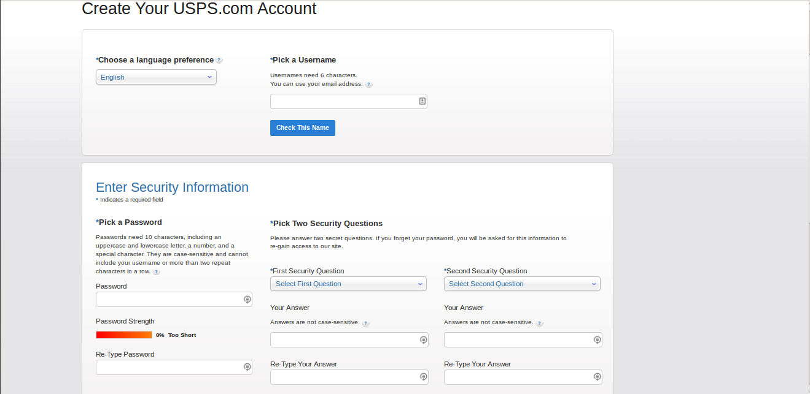
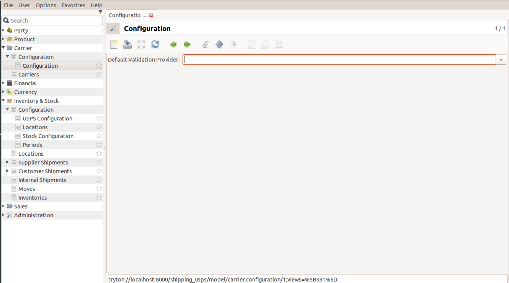
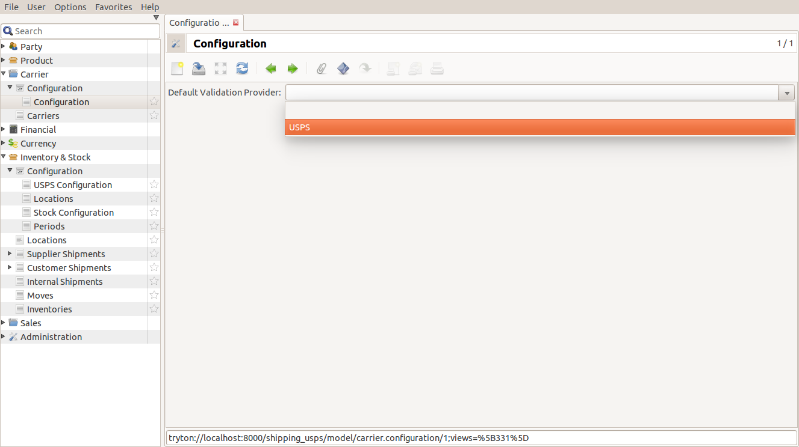
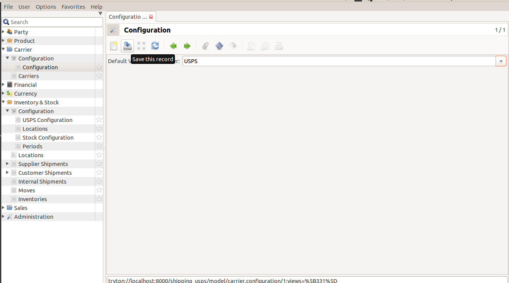
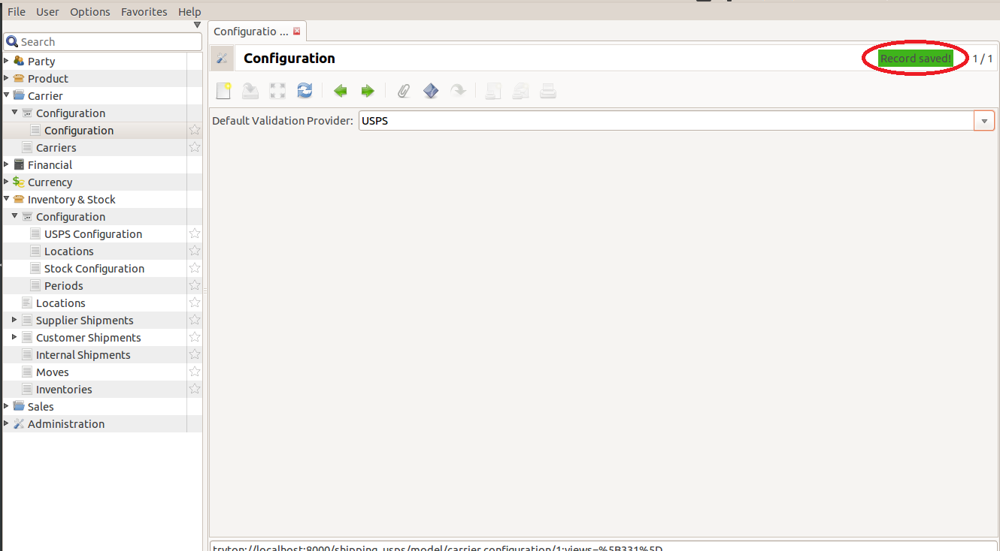
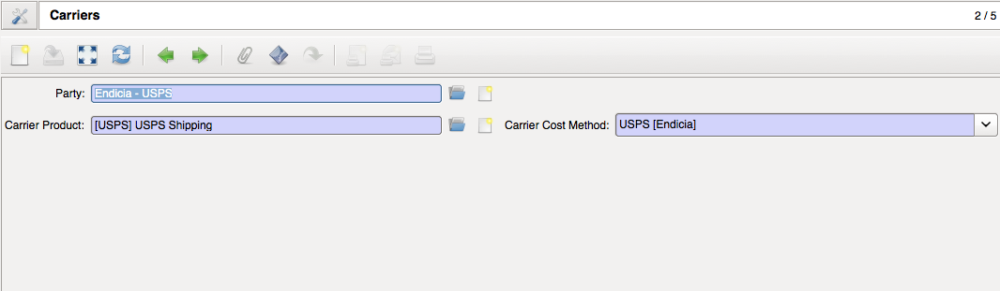

USPS Configuration
================== 

Follow the documentation below to do the initial setup and configuration 
using the USPS user credentials. This guide documents how to set up the 
USPS User ID and its subsequent configuration in Tryton.

* `Setting up USPS User ID`_
* `Configuring USPS Settings in Tryton`_

.. _Setting up USPS User ID:

USPS User ID Setup
+++++++++++++++++++

1. Fill out USPS Web Tools Registration Form and register for USPS Web Tools
   User ID.



.. note::

   Contact USPS Directly if there is any problem at this stage.

2. When the sign-up process is complete, USPS ID will be sent on your mail.
   This ID is required to complete activation on Tryton.

.. note::
   
   USPD Web Tools User ID combines both letters and numbers and is generated
   automatically by USPS.

.. _Configuring USPS Settings in Tryton:

USPS Settings in Tryton
++++++++++++++++++++++++

Click on ``Inventory & Stock`` >> ``Configuration``.

2. Double click on ``USPS Configuration``.



3. In the drop-down menu, choose USPS as your default carrier.



4. Click on ``Save this record`` button at the top.



5. The record has been saved. 



USPS Carrier configuration has been successfully done.

Creating Carrier
````````````````

In order to define a new carrier, follow mentioned steps:

1. Go to Carrier from the side menu and create a new carrier.

2. It has the following fields:

* `Party`: This can be the company.
* `Carrier Product`: A new product called USPS can be created from here.
* `Carrier Cost Method`: If the module USPS is installed, this dropdown option can be seen.




